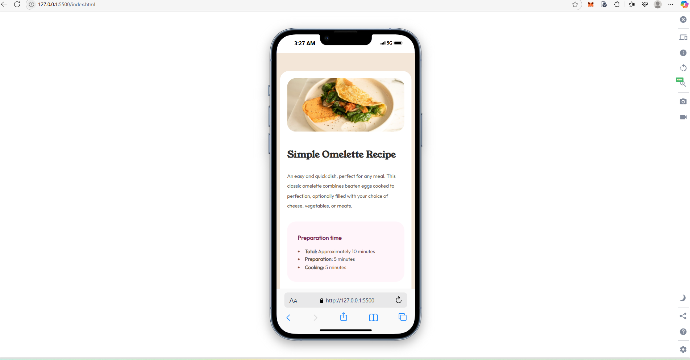

# Frontend Mentor - Recipe page solution

This is a solution to the [Recipe page challenge on Frontend Mentor](https://www.frontendmentor.io/challenges/recipe-page-KiTsR8QQKm). Frontend Mentor challenges help you improve your coding skills by building realistic projects. 

## Table of contents

- [Frontend Mentor - Recipe page solution](#frontend-mentor---recipe-page-solution)
  - [Table of contents](#table-of-contents)
  - [Overview](#overview)
    - [Author:](#author)
    - [Screenshot](#screenshot)
    - [Links](#links)
  - [My process](#my-process)
    - [Built with](#built-with)
    - [What I learned](#what-i-learned)
    - [Continued development](#continued-development)
  - [Acknowledgments](#acknowledgments)

## Overview
This is a page recipe design

### Author: 
Sunday Justice Gabriel

### Screenshot

### Links

- Solution URL: [Add solution URL here](https://github.com/zuru122/Recipe-page)
- Live Site URL: [Add live site URL here](https://recipe-page-gwns.vercel.app/)

## My process
* I first structured my content using html
* then styled it using css
* I made used of flex box instead of table for the nutrition content
* and also, I amd use of helper class for margin bottom.

### Built with

- Semantic HTML5 markup
- CSS custom properties
- Flexbox
- Desktop-first workflow

### What I learned

I learnt more about css flex box, flex 1, taking the max width and about media query and I believe as I move on, I will perfect my media query skills.

### Continued development

I want to practice more, makebeautiful sites with all I have learnt so, I need to focus on Flex, Grid, animations, media query and Js

## Acknowledgments

I want to appreciate FrontEnd Mentor for helping me develop problem solving skills by giving tasks based on my current level and beyond.
